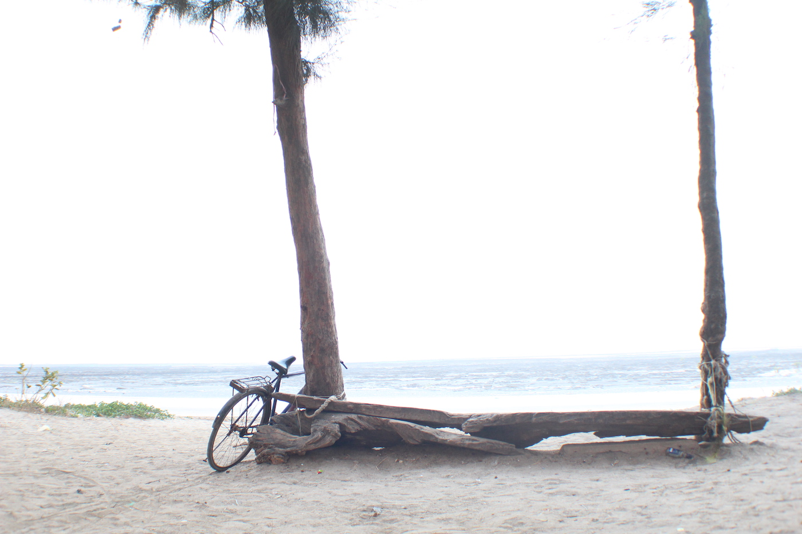
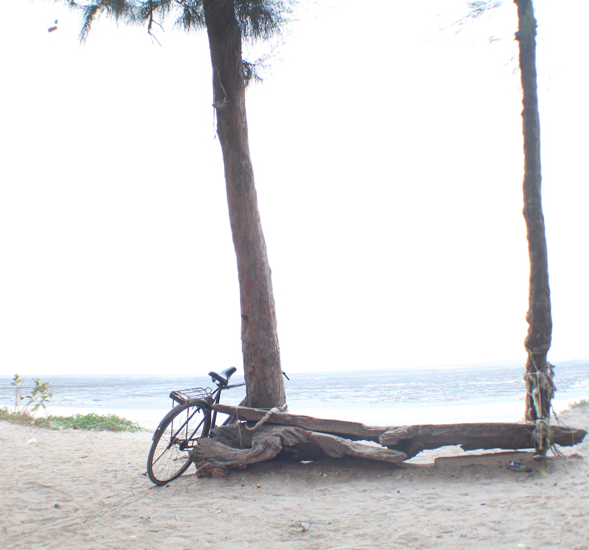
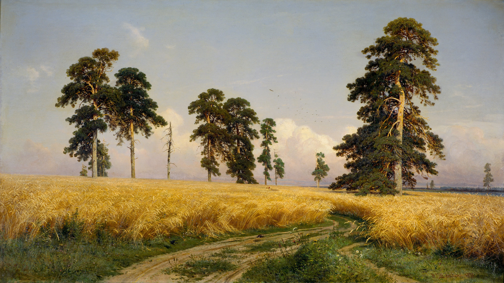
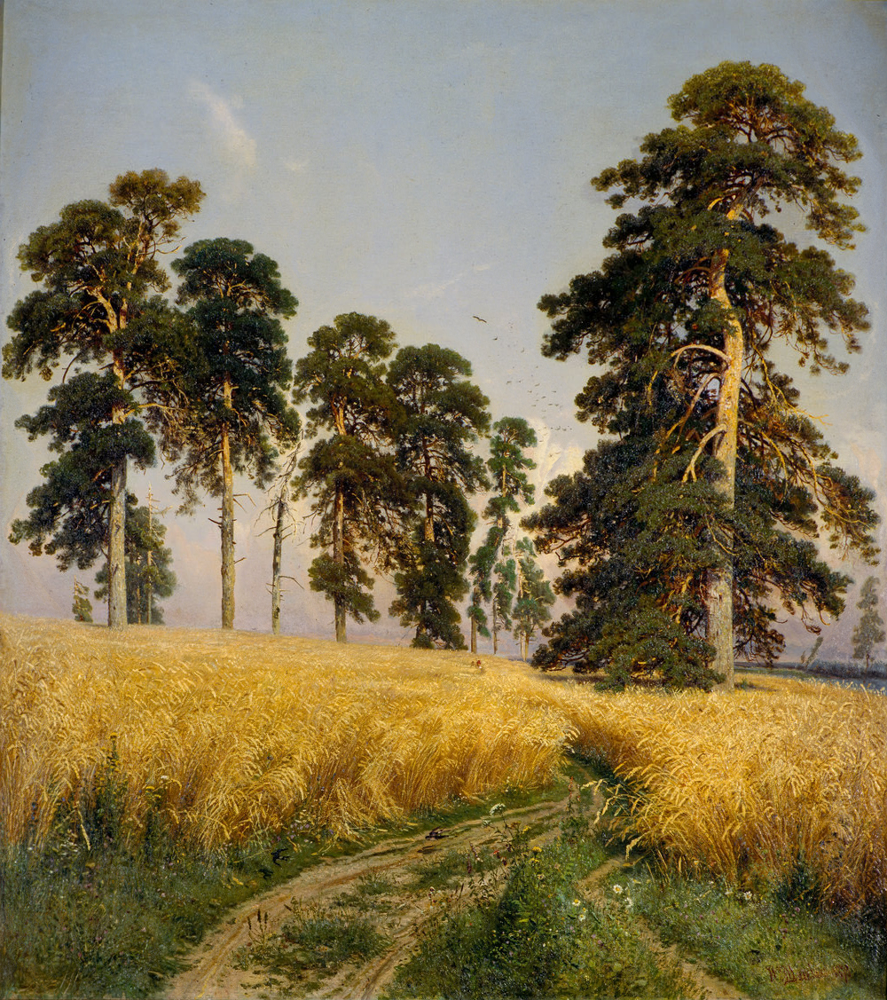

# Image Resizer
Image resizing applicationg based on Seam carving algorithm

### Options

  - "GPU" - use GPU for calculations
  - "Pretty lines" - algorithm uses forward energy, takes more time
  - "Autosave" - saves result image in current directory as "result.png"

### Dependencies

  - Qt 5.2
  - OpenCl 2.2

### Examples

<p float="left">
  
  
</p>

> From 1400 px wide to 1000 px


<p float="left">
  
  
</p>

> From 2000 px wide to 1000 px

### Installiation

Run ```
$ ./install.sh
```
